# UI reference — mobile screens

A visual walkthrough of every major screen, captured from the real app (live backend, not mock data) on an Android device profile (Pixel 7, 412×915). Use this the way you'd use a Figma flow board — to see what a screen looks like and where it sits in the flow, without having to run the app. For how these screens are built and how state moves between them, see [ARCHITECTURE.md](ARCHITECTURE.md).

Screenshots live in [`screenshots/`](screenshots/) and were captured with a small Playwright script (not checked in — see "Regenerating" at the bottom) against `npm run dev:uat`.

---

## 1. Onboarding

<table>
<tr>
<td align="center" width="240">
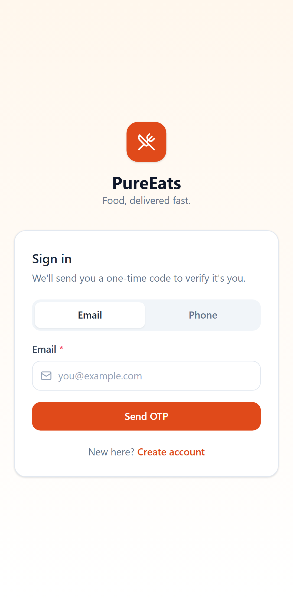 
<b>Sign in</b> 
Email or phone, OTP-based — no passwords anywhere in this app.
</td>
<td align="center" width="240">
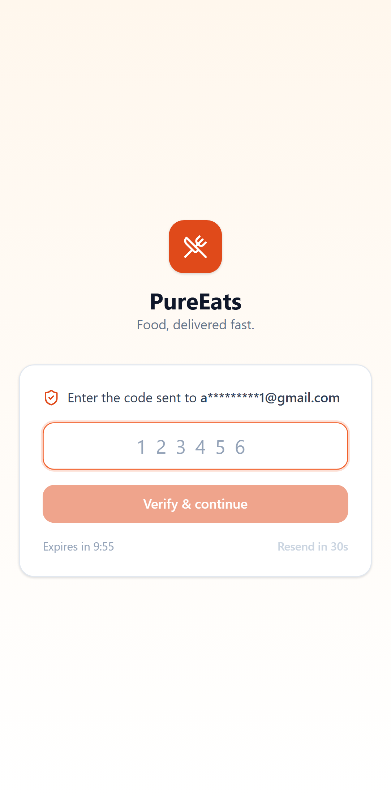 
<b>Enter the code</b> 
6-digit OTP, countdown + resend cooldown.
</td>
</tr>
</table>

## 2. Home & discovery

<table>
<tr>
<td align="center" width="240">
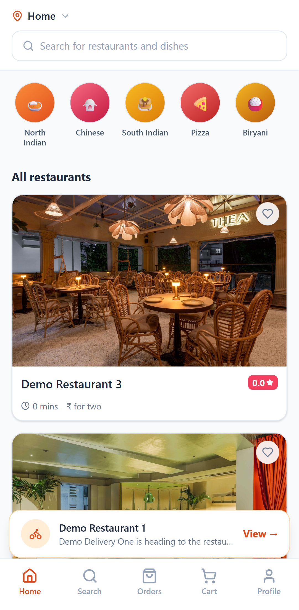 
<b>Home</b> 
Cuisine shortcuts + restaurant feed. The card near the bottom is the live <code>OngoingOrderBar</code> — "Demo Delivery One is heading to the restaurant" is a real, polled backend status, not a placeholder.
</td>
<td align="center" width="240">
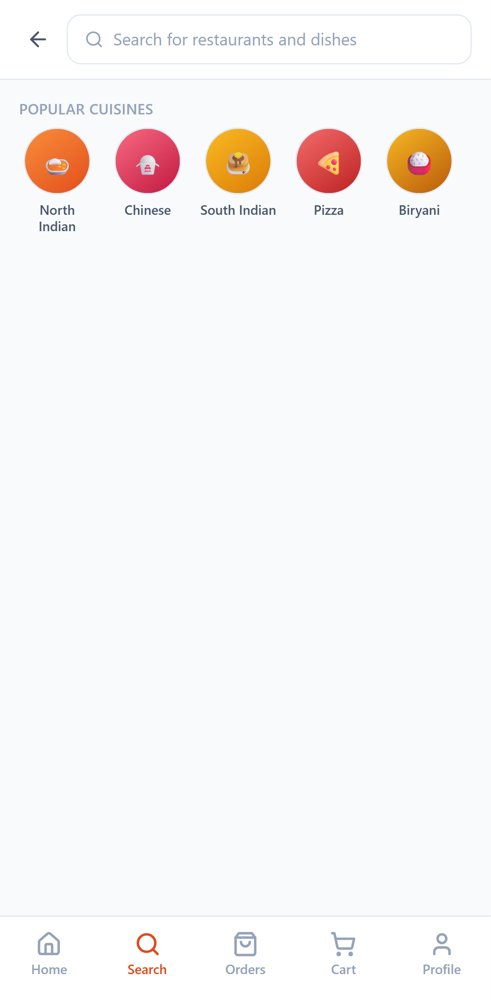 
<b>Search</b> 
Search restaurants and dishes; cuisine grid before you type.
</td>
</tr>
</table>

## 3. Ordering — menu to cart

<table>
<tr>
<td align="center" width="240">
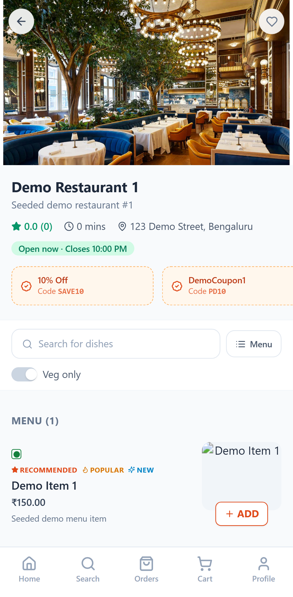 
<b>Restaurant menu</b> 
Coupons strip, veg filter, menu list. "ADD" adds straight to cart.
</td>
<td align="center" width="240">
 
<b>Cart — no address yet</b> 
"Proceed to pay" is disabled until an authenticated user picks a delivery address.
</td>
<td align="center" width="240">
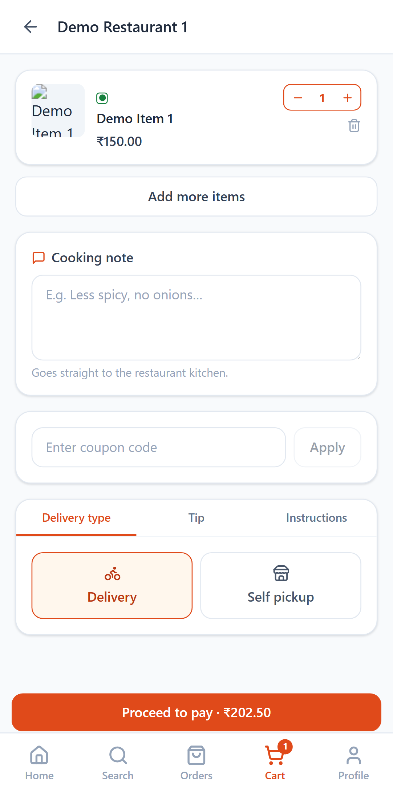 
<b>Cart — priced</b> 
Once an address is set, <code>/cart/validate</code> prices the cart live against the backend — item total, tax, restaurant charge, and distance-based delivery charge all come from the server, not a client-side guess.
</td>
</tr>
</table>

## 4. Delivery address

<table>
<tr>
<td align="center" width="240">
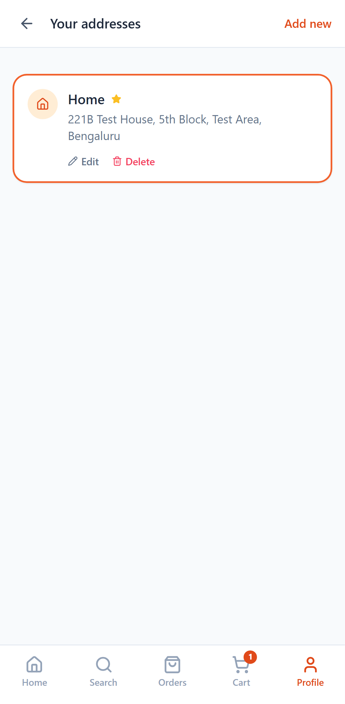 
<b>Saved addresses</b> 
Default address starred; edit/delete inline.
</td>
<td align="center" width="240">
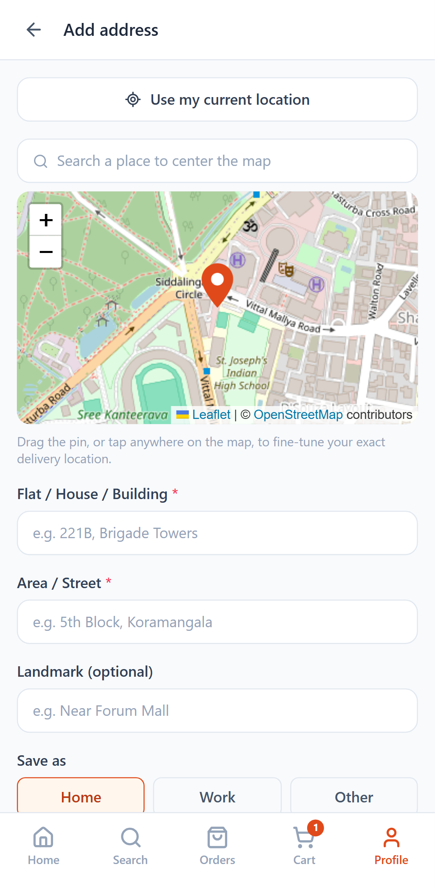 
<b>Add address</b> 
Drag-the-pin map picker (OpenStreetMap/Leaflet) or use current location. Saving here returns straight back to the Cart page if that's where you came from.
</td>
</tr>
</table>

## 5. Checkout & orders

<table>
<tr>
<td align="center" width="240">
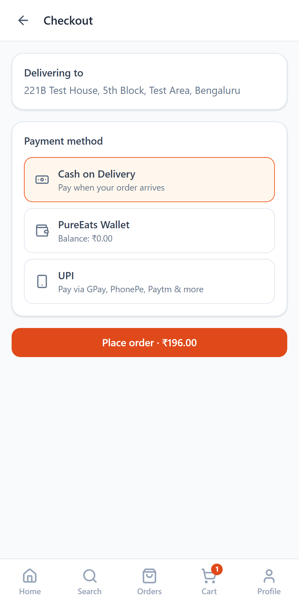 
<b>Checkout</b> 
COD / Wallet / UPI. The payment method list itself is admin-configurable via the app-config endpoint.
</td>
<td align="center" width="240">
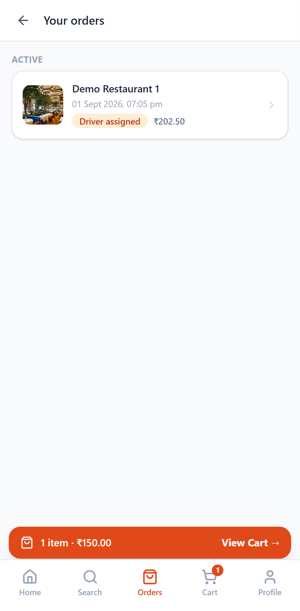 
<b>Your orders</b> 
Real restaurant image and a live status pill, both sourced from the backend.
</td>
<td align="center" width="240">
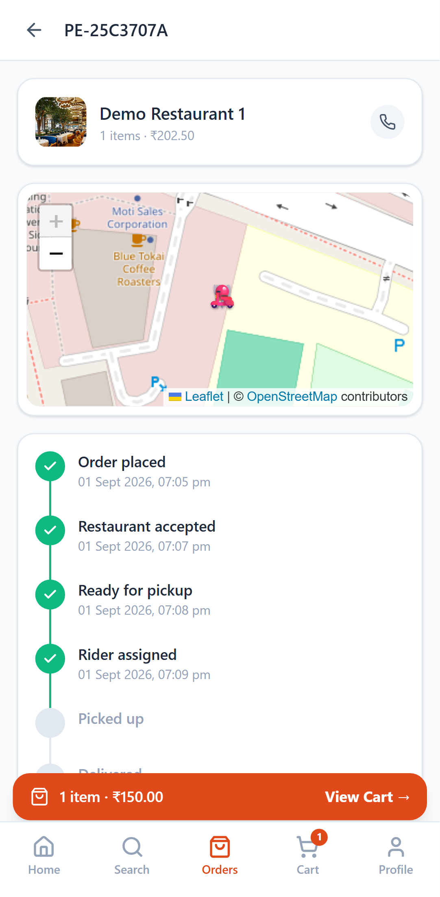 
<b>Order tracking</b> 
Polls the backend every ~8s. The milestone timeline, map, and delivery PIN update themselves — no manual refresh needed as the order moves through restaurant-accepted → rider-assigned → delivered.
</td>
</tr>
</table>

## 6. Profile & account

<table>
<tr>
<td align="center" width="240">
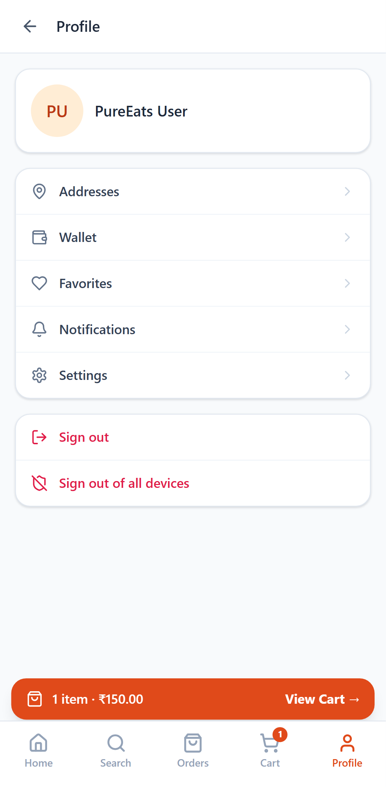 
<b>Profile</b>
</td>
<td align="center" width="240">
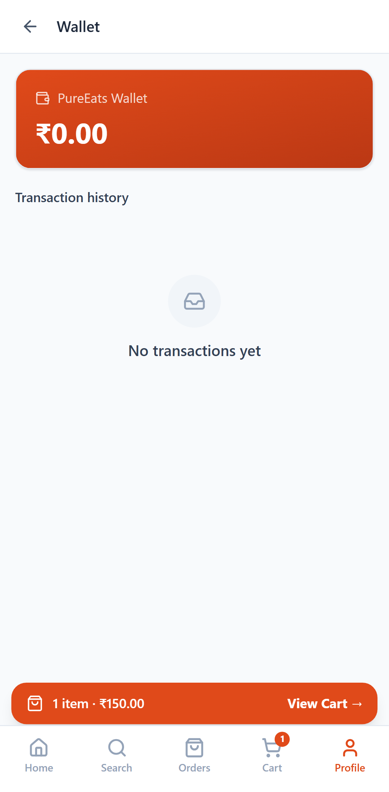 
<b>Wallet</b>
</td>
<td align="center" width="240">
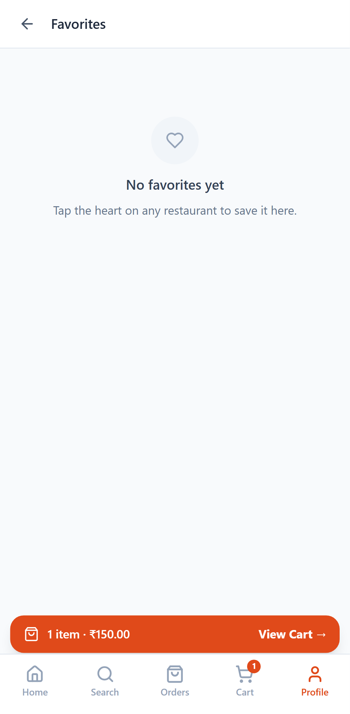 
<b>Favorites</b>
</td>
</tr>
<tr>
<td align="center" width="240">
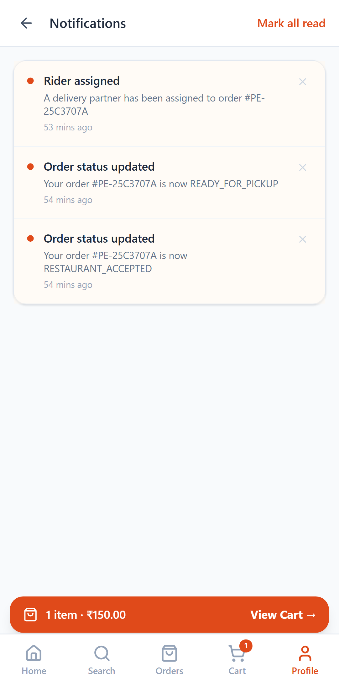 
<b>Notifications</b> 
Real push-style entries from <code>NotificationDispatchService</code> as this order's status changed.
</td>
<td align="center" width="240">
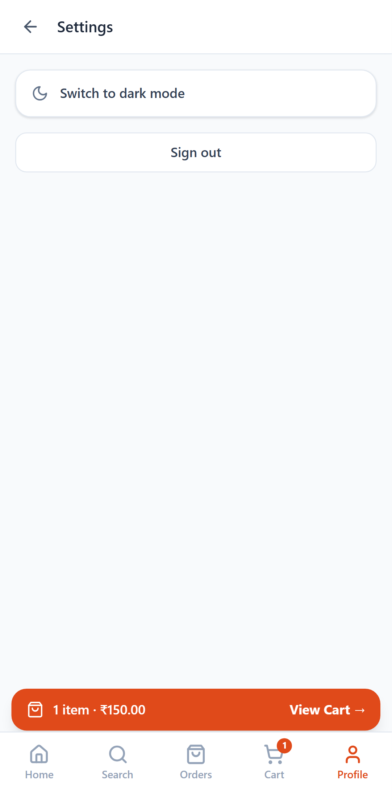 
<b>Settings</b> 
Theme toggle, sign out.
</td>
<td></td>
</tr>
</table>

---

## Regenerating these screenshots

Not checked in as a script (kept out of the repo to avoid a Playwright/Chromium dependency for everyone who clones this). To reproduce:

1. `npm install --no-save playwright && npx playwright install chromium`
2. Start the backend (`pureeats-backend-2026`, `dev` profile) and this app (`npm run dev:uat`).
3. Write a short Playwright script that logs in (email `arpangroup1@gmail.com` in dev, OTP always `123456`), uses `devices['Pixel 7']` for the device profile, navigates each route in [`AppRoutes.tsx`](../src/routes/AppRoutes.tsx), and calls `page.screenshot({ path, fullPage: false })` — **`fullPage: false` matters**: a full-page capture stitches multiple scroll positions together and bakes fixed/sticky elements in at the wrong spot, which doesn't happen on a real phone.
4. Save into `docs/screenshots/`, replacing the files here.
