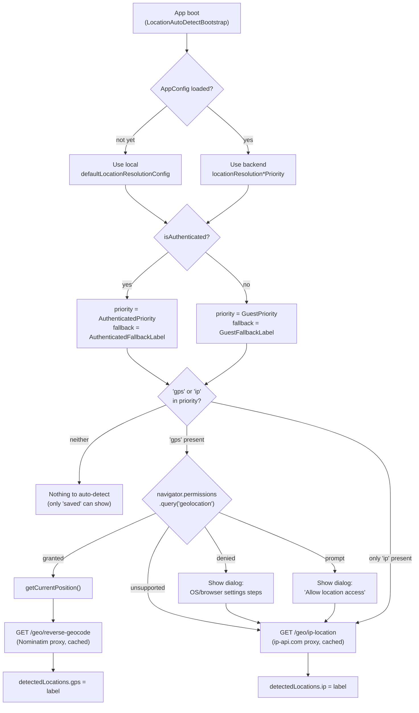
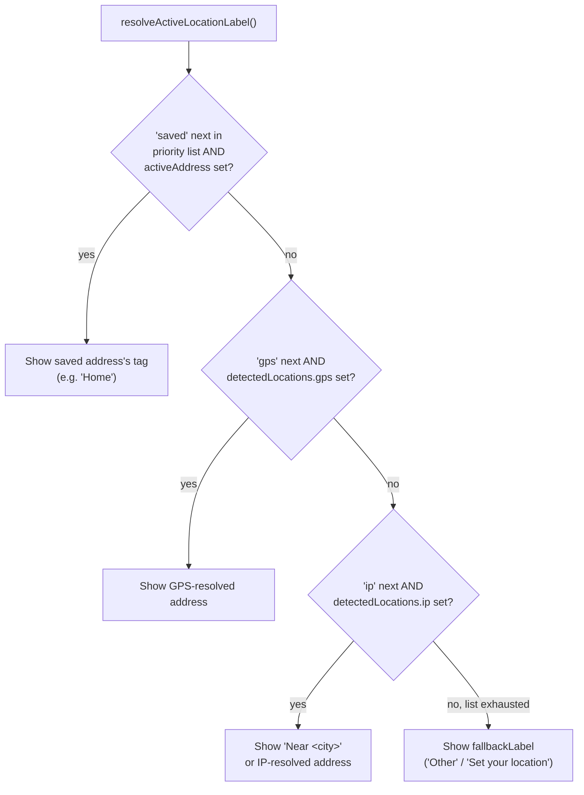

# Active-address resolution

How PureEats decides what to show as the customer's "active address" / delivery location on the home page, why the reverse-geocoding call goes through the backend instead of the browser, and the two architecture questions (restaurant-listing lat/lon, resolve-at-boot) this feature raised but didn't fully implement. See [flow-diagram.html](flow-diagram.html) for the same flow as a picture.

## The short version

Four sources can produce an "active address" label, tried in a **backend-configurable priority order**, separately for logged-in customers and guests:

| Source | What it is | Needs |
|---|---|---|
| `saved` | The customer's saved default delivery address | Logged in (`GET /users/me/addresses`, auto-selected by `LocationBootstrap`) |
| `gps` | Real device GPS, reverse-geocoded to a street address | Browser permission granted |
| `ip` | Coarse, city-level guess from the caller's IP | Nothing — works for guests |
| *(fallback text)* | A static label when nothing above resolved | — |

The first source in the configured priority list that has a value wins the display. Nothing else about the app depends on the order — restaurants, cart, checkout all still work regardless of which source (or none) resolved.

## Where the config lives

Same pattern as every other feature flag in this app (`audioSearchEnabled`, `mapProvider`, ...): one JSON blob in the backend's generic `settings` table (key `app_config`), served by `GET /api/v1/app-config` and editable by an admin via `PUT /api/v1/admin/app-config`. Four new fields:

```jsonc
{
  "locationResolutionAuthenticatedPriority": ["saved", "gps", "ip"],
  "locationResolutionGuestPriority": ["gps", "ip"],
  "locationResolutionAuthenticatedFallbackLabel": "Set your location",
  "locationResolutionGuestFallbackLabel": "Other"
}
```

- Reorder either priority array to change precedence (e.g. put `"ip"` before `"gps"` to prefer the instant-but-coarse guess).
- Drop `"gps"` from an array to stop that flow from ever asking for browser permission (the dialog disappears too — nothing left to ask permission *for*).
- Drop `"ip"` to stop calling the IP-geolocation fallback.
- `"saved"` in `locationResolutionGuestPriority` is harmless but pointless — a guest has nothing saved, so it never resolves.

**Frontend fallback**: until `/app-config` resolves (or against an older backend that doesn't have these fields yet), the customer app uses `src/config/locationResolution.ts`'s `defaultLocationResolutionConfig` — the exact same shape, mirrored by hand. `AppConfigContext` merges `config?.field ?? DEFAULTS.field` per field, so a backend that's missing just one of the four (not yet redeployed, say) still gets safe values for that one field without discarding the rest.

## Resolution algorithm

`src/lib/locationResolution.ts` → `resolveActiveLocationLabel()` — a pure function, no side effects:

```ts
for (const source of sourcePriority) {
  if (source === 'saved' && activeAddress) return activeAddress.tag ?? 'Delivering to'
  if (source === 'gps' || source === 'ip') {
    const detected = detectedLocations[source]
    if (detected) return detected.label
  }
}
return fallbackLabel
```

`sourcePriority` and `fallbackLabel` are picked by auth state (`useActiveLocationLabel()`), so the same function serves both `HomePage`'s mobile header and `TopNavBar`'s desktop one — no duplicated priority logic.

`gps` and `ip` results are stored **separately** in `LocationContext` (`detectedLocations: { gps?, ip? }`), not merged into one "last resolved" slot — otherwise whichever finished last would always win, which breaks a priority order that puts `ip` ahead of `gps`.

## Detection flow (when do we actually try GPS/IP?)

`useLocationAutoDetect()`, mounted once at app boot (`LocationAutoDetectBootstrap`, next to `LocationBootstrap` in `App.tsx`) — see [flow-diagram.html](flow-diagram.html):

1. Look up the current auth state's priority list. If it contains neither `gps` nor `ip`, there's nothing to auto-detect — stop.
2. If it contains `gps`, check `navigator.permissions.query({name:'geolocation'})` (falls back to `'prompt'` on Safari, which doesn't implement the Permissions API for geolocation):
   - **`granted`** → call GPS directly, no dialog. Reverse-geocode the result via the backend.
   - **`denied`** → show `LocationPermissionDialog` with OS/browser-specific settings instructions (browsers refuse to re-trigger their own native permission prompt once blocked — the customer has to flip it back on themselves), *and* kick off the IP fallback in the background so the label isn't stuck empty while they decide whether to bother.
   - **`prompt`** (never asked) → show the dialog with a plain "Allow location access" button, so the real native permission prompt fires from a deliberate tap rather than an unexplained page-load popup. IP fallback also runs in the background here.
   - **unsupported** → straight to IP fallback.
3. If the priority list contains `gps` but not `ip` (or vice versa), only that one source is ever attempted — see `gpsEnabled`/`ipEnabled` in `useLocationAutoDetect.ts`, both derived from the config.
4. Re-runs once if auth state changes mid-session (login/logout), since the guest and authenticated priority lists can differ.

The dialog itself (`LocationPermissionDialog` + `src/lib/platform.ts`) detects OS/browser/standalone-PWA-or-not and renders the matching path — e.g. Chrome/Edge get a copy-to-clipboard deep link straight to `chrome://settings/content/siteDetails?site=<origin>` (browsers block a website from *navigating* there directly — copy-and-paste is the closest a page can offer), iOS gets Settings app instructions, etc.

## Flow diagram

**1. Detection** — deciding which sources actually get a value:



**2. Display** — deciding which resolved value actually shows, once (or before) detection finishes:



## API reference

| Endpoint | Auth | Purpose |
|---|---|---|
| `GET /api/v1/app-config` | Public | Serves the priority/fallback config above, alongside every other feature flag |
| `PUT /api/v1/admin/app-config` | Admin | Edits it |
| `GET /api/v1/geo/ip-location` | Public | IP → coarse `{latitude, longitude, city, country}`, ip-api.com proxy, server-side cached |
| `GET /api/v1/geo/reverse-geocode?lat=&lon=` | Public | Coordinates → `{displayName, city, state, country, postcode}`, Nominatim proxy, server-side cached |

Both `/geo/*` endpoints follow the exact same shape: an interface (`IpGeolocationService` / `ReverseGeocodingService`), one HTTP implementation with an in-memory TTL cache, gated by a `@ConfigurationProperties` block (`security.geolocation.*` / `security.reverse-geocoding.*`) so the provider, timeout, and cache TTL are all env-configurable without a code change, and both degrade to `null` fields (never a 4xx/5xx) when the provider can't resolve anything — callers always get a 200 with best-effort data.

---

## Design decisions

### Reverse geocoding: backend proxy, not a direct browser call

**Implemented.** The customer app calls `GET /geo/reverse-geocode` (backend) instead of `nominatim.openstreetmap.org` directly. Reasons:

1. **Nominatim's usage policy requires a `User-Agent` header identifying the application** (or a valid Referer) — a browser `fetch()` can't set a custom `User-Agent` at all, so a direct client call structurally can't comply as cleanly as a server-side one can.
2. **Ad blockers and privacy extensions intermittently block direct third-party geocoding calls** client-side — this was actually observed while building this feature (see the debugging session that led here). A backend call is invisible to the customer's browser extensions.
3. **Server-side caching actually caches.** A client-side cache only helps one customer revisit the same spot; a backend cache (keyed by rounded lat/lon, ~11m buckets) is shared across every customer near the same location — meaningfully cuts real request volume against Nominatim's public instance, which caps usage at ~1 req/sec.
4. **Provider swaps don't need a frontend deploy.** `security.reverse-geocoding.provider` picks the implementation server-side; a paid provider (Google, Mapbox, a self-hosted Nominatim) is a new `ReverseGeocodingService` bean, not a client change.

The one thing this trades away: routing *all* reverse-geocode traffic through one backend process means the backend's own outbound IP is what's rate-limited by Nominatim under real load, rather than each customer's own IP absorbing it individually. The cache directly offsets this — most reverse-geocode requests in a dense delivery area will hit the same rounded-coordinate bucket repeatedly.

**Not yet done, worth doing for consistency**: `src/lib/osmGeocoding.ts`'s `osmReverseGeocode()` (used by the address-form map picker when a customer drags the pin to set a *saved* address) still calls Nominatim directly from the browser. It's a different feature (setting a new address vs. auto-detecting the current one) and was out of scope here, but the same rationale applies — routing it through `/geo/reverse-geocode` too would be a natural follow-up.

### Resolve at app load, for a smoother first paint

**Implemented.** `useLocationAutoDetect()` moved from being mounted inside `HomePage` to `LocationAutoDetectBootstrap`, mounted once in `App.tsx` next to `LocationBootstrap` — resolution starts the instant the app boots, not when `HomePage` specifically mounts. The "active address" pill is visible in `TopNavBar`/`HomePage`'s header from first paint, so resolving late means it visibly flips from "Set your location"/"Other" to a real value a beat later; resolving at boot means it's more likely already correct by the time the customer looks at it.

Trade-off accepted: the permission dialog can now appear on *any* first-landed page (e.g. a deep link straight into a restaurant), not only Home. It only ever appears once per tab session and is a lightweight bottom sheet, which is judged an acceptable cost for the smoother common case.

### Should restaurant-listing require lat/lon, or should the backend also resolve IP itself?

**Recommended, not implemented** — this is a materially larger change (touches `RestaurantController`/`RestaurantService`, a distance calculation, and how that interacts with existing sorting/pagination) than the active-address label this task actually covered, and risks regressing the existing listing if done half-way. Documenting the recommendation here rather than guessing at the full implementation:

- `GET /restaurants` should accept **optional** `lat`/`lon` query params. When present, sort/filter by distance from that point (the frontend already resolves this via the flow above, whenever it has it).
- When **absent**, the backend should resolve the caller's IP itself — reusing the exact same `IpGeolocationService` this feature already added a public endpoint for — rather than returning an undifferentiated list or erroring. This is a **hybrid**, not an either/or: the frontend's resolved coordinates are more accurate and should be preferred when available, but the contract shouldn't hard-require them, so the very first request (before client-side resolution finishes) still gets a reasonable answer instead of an unsorted flash of content.
- This makes the restaurant list robust to frontend timing entirely — no need to sequence "resolve location, *then* fetch restaurants" on the client; the backend degrades gracefully on its own.

## Out of scope / explicit non-goals here

- Admin-panel UI to edit the four new `locationResolution*` fields (`pureeats-react-ui`) — the backend accepts them via the existing generic `PUT /api/v1/admin/app-config`, but no form field was added for them; today an admin would edit the JSON directly or a form field needs adding.
- Wiring resolved GPS/IP coordinates into actual restaurant-distance sorting (see the recommendation above) — coordinates are captured and available in `LocationContext.detectedLocations`, but nothing currently consumes them for that purpose.
- Routing the address-form map picker's reverse-geocoding through the backend too (see "Reverse geocoding" above).
